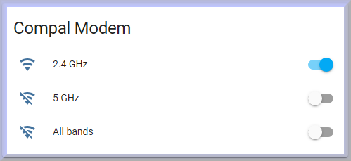

# Compal WiFi integration for Home Assistant

Home Assistant component to switch WiFi of the modem Compal CH7465LG on or off.



The component is tested with the modem firmware version ```CH7465LG-NCIP-6.15.28-4p8-NOSH```.

## Installation

1. Using the tool of choice open the directory (folder) for your HA configuration (where you find `configuration.yaml`).
2. If you do not have a `custom_components` directory (folder) there, you need to create it.
3. In the `custom_components` directory create a new folder called `compal-wifi`.
4. Download _all_ the files from the `custom_components/compal-wifi/` directory from this repository.
5. Place the files you downloaded in the new directory you created.
6. Move on to the configuration in the file `configuration.yaml`.
7. Restart Home Assistant.

## Configuration 
 
Add a configuration to your `configuration.yaml` file:
``` yaml
switch:
  - platform: compal_wifi
    host: 192.168.0.1
    password: YOUR_PASSWORD
```

### Configuration options

Key | Type | Required | Description
--- | ---- | -------- | -----------
`host` | `string` | `True` | The hostname or IP address of your compal modem, e.g., 192.168.0.1.
`password` | `string` | `True` | The password for your modems administration account.
`guest_macs_2g` | `string[]` | `False` | List of guest MAC addresses to enable when switching ON 2G WiFi band. 
`guest_macs_5g` | `string[]` | `False` | List of guest MAC addresses to enable when switching ON 5G WiFi band.
`pause` | `int` | `False` | Number of seconds to wait between modem changes (default 60s).


## Platforms

### Switch
The componet offers three switches to turn WiFi bands on or off:

Entity | Description
------ | -----------
`switch.wifi_2g` | Switch for 2.4 GHz WiFi band.
`switch.wifi_5g` | Switch for 5 GHz WiFi band.
`switch.wifi_all` | Switch for both WiFi bands. 

Be aware, swiching WiFi bands on or off are slow operations. If you want to switch all bands on or off better use the
composit switch (all) instead of the single band switches. 
The switches offer additional state info to supervise the current switch progess.

The WiFi switches offer the following state information

Name | Values | Description
---- | ------ | -----------
`state` | `on` or `off` | Switch state.
`switch_progress` | `on`, `off` or `error` | Whether a swich change is in progress or not or `error` if the last switch operation was faulty.
